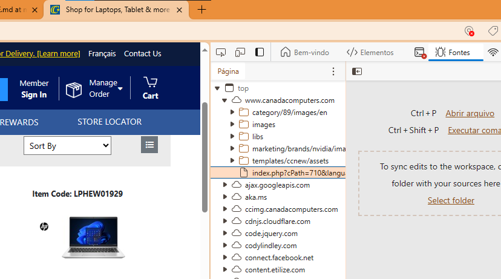

## Tools

- Visual code; text editor
- github
- markdown: txt that is smart
    (in visual code)
    - ctrl+p
    - \>open preview to the side

## Web scraping

- Website investigation using browser developer tools
    - ctrl+shift+i 
    
- html, we are going to find where the information is
- i want to find out whether all the information desired is inside the first transaction of the website

3 type of website:

1) All the content is inside the first transaction

1) The frame is in the first transaction and the data is in another one (usually a specific api)

1) Something else

if the is the first type of website, you can work directily in python, using a library called requests

## String processing

how to use regex to find words like $1,000.00 in a text:
Certainly! Let's delve into the explanation:

1. `r'\$`: This part of the pattern matches the dollar sign `$`. The `$` is a special character in regular expressions, indicating the end of a line. However, when preceded by a backslash `\`, it's interpreted as a literal dollar sign.

2. `\d{1,3}`: This part matches one to three digits. `\d` is a shorthand character class that matches any digit (equivalent to `[0-9]`). The `{1,3}` quantifier specifies that the preceding `\d` should match between 1 and 3 times.

3. `(?:,\d{3})*`: This is a non-capturing group `(?:...)` that matches the thousands separator and the following three digits (if present). 
   - `(?:...)` is a non-capturing group, meaning it's used for grouping but doesn't capture the matched text.
   - `,` matches a comma.
   - `\d{3}` matches exactly three digits.
   - `*` quantifier means the whole non-capturing group can repeat zero or more times, allowing for multiple occurrences of thousands separators and digits.

4. `(?:\.\d{2})?`: This is another non-capturing group that matches the decimal part, if present.
   - `\.` matches the decimal point.
   - `\d{2}` matches exactly two digits after the decimal point.
   - `?` quantifier makes the whole non-capturing group optional, allowing for numbers without cents.

By using non-capturing groups, we avoid capturing unnecessary parts of the matched text, which can improve performance and make the code cleaner. The corrected pattern should correctly match amounts like "$1,000.00", "$500.50", etc., in the text.